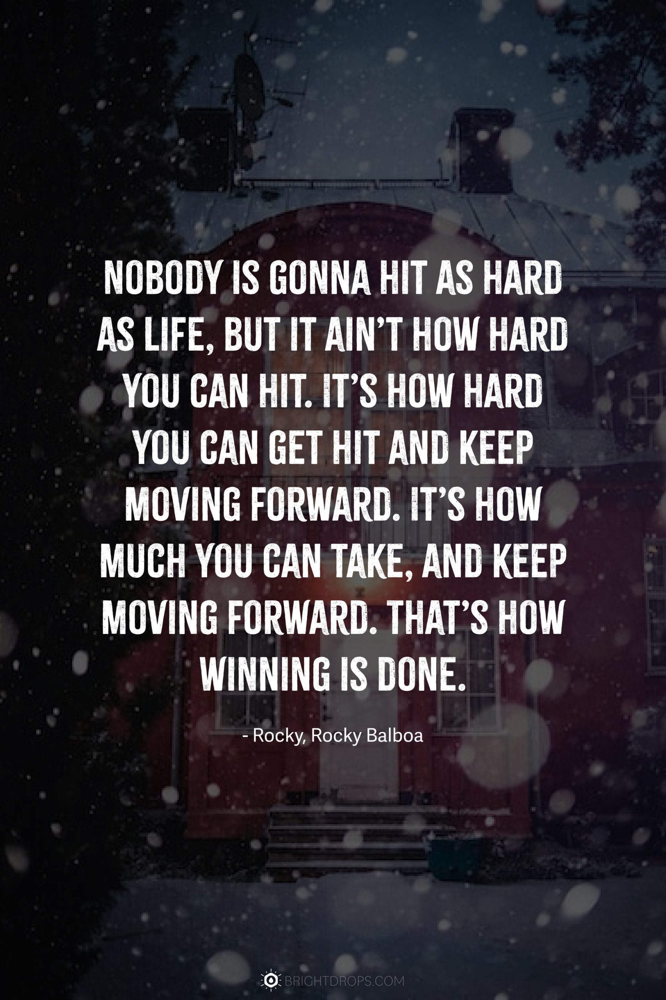

#  🔧Systems, Sparks & Syntax 

<!-- banner -->

   

---

# Hey, **Jofel** here 👋

  

> __I’m Jofel, an Electronics & Communications engineer. From gesture-controlled robotic arms to predictive models for agriculture, I strive to make a difference deploying tech.__

---

## 🚀 Featured Projects

 Robotic Arm controlled by gestures

**Tech**: ESP-NOW, PCA9685, MPU6050  
**Highlights**:
- Real-time gesture capture  
- Smooth servo control for precision  

 Water Quality Indicator for Agriculture and Mining

**Tech**: XAMPP → MySQL, Arduino IDE, PHP  
**Highlights**:
- 4-parameter model (pH, Temperature, TDS, Turbidity)  
- Live dashboard integration  

---

## 🛠️ Tech Stack

  
  
   
  
  
  

---

## 🌐 Connect With Me

  
  &nbsp;&nbsp;
  

---

