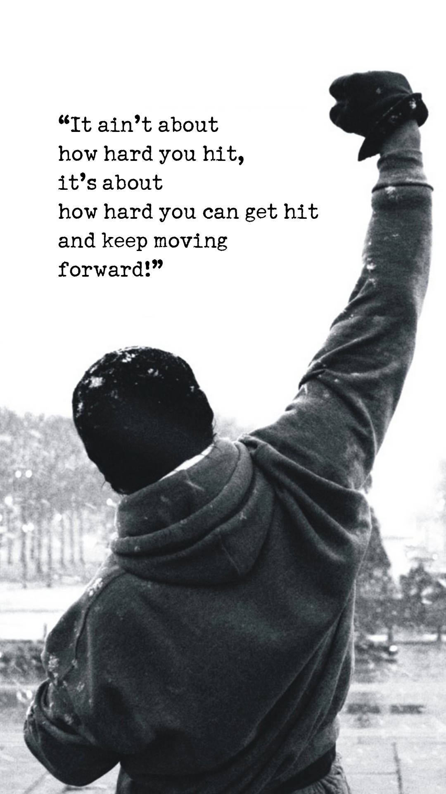

# 📘 Portfolio & Projects

<!-- Full-width banner, auto height -->

  

---

# Hey, I’m **Jofel** 👋

  

## 💥 _About Me_

> _"I’m Jofel, an Electronics & Communications engineer hardware. From gesture-controlled robotic arms to predictive models for agriculture, I strive to make a difference deploying tech."_

---

## 🚀 Featured Projects

🤖 Robotic Arm controlled by gestures

**Tech**: ESP-NOW, PCA9685, MPU6050  
**Highlights**:
- Real-time gesture capture  
- Smooth servo control for precision  

🌱 Water Quality Indicator for Agriculture and Mining

**Tech**: XAMPP → MySQL, Arduino IDE, PHP  
**Highlights**:
- 4-parameter model (pH, Temperature, TDS, Turbidity)  
- Live dashboard integration  

---

## 🛠️ Tech Stack

  
  
   
  
  
  

---

## 🌐 Connect With Me

  <!-- Gmail “M” icon -->
  
  &nbsp;&nbsp;
  <!-- Professional LinkedIn logo -->
  

---

  <em>Jofel P Jestin</em>

